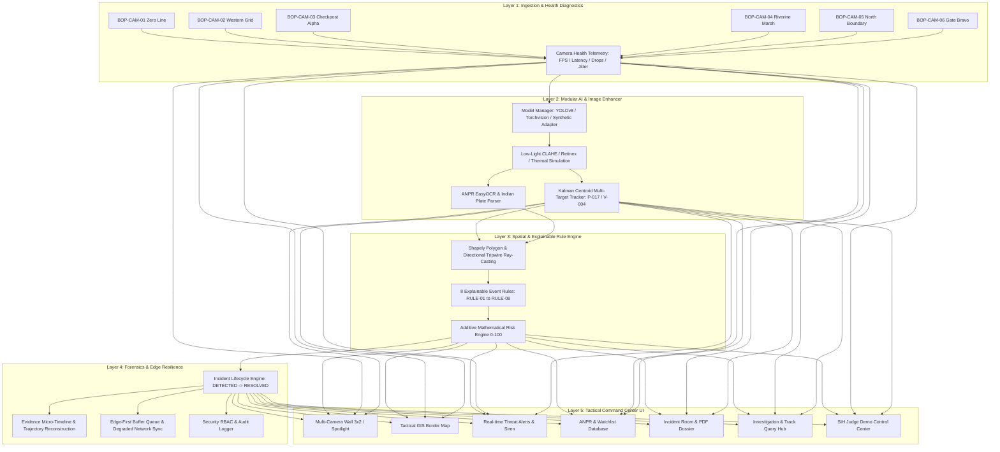

# System Architecture — IBVAP 3.0

**Intelligent Border Video Analytics Platform**  
*Ministry of Home Affairs | Sashastra Seema Bal (SSB), Police II Division*

---

## 1. System Overview

IBVAP 3.0 converts standard IP-based CCTV cameras at Border Out Posts (BOPs), checkposts, and zero-line perimeters into an autonomous software-defined surveillance matrix with zero proprietary smart-camera hardware lock-in.

---

## 2. Layer-by-Layer Architectural Breakdown

### Layer 1: Video Ingestion & Camera Health
- **Stream Formats**: RTSP, IP CCTV, Multipart JPEG, Prerecorded Video, and Synthetic Feeds.
- **Continuous Diagnostics**: Monitors real-time FPS, frame jitter, processing latency (ms), bitrate (kbps), and dropped frame ratios.
- **Fault Detection**: Flags streams transitioning from `HEALTHY` to `DEGRADED` (e.g. low FPS, high latency recommendation) or `OFFLINE`.

### Layer 2: Modular AI & Model Adapter Architecture
- **DetectorAdapterBase**:
  * `YOLOv8DetectorAdapter`: Production deep neural network for live edge GPU inference.
  * `TorchvisionDetectorAdapter`: Standard CPU/Torchvision fallback.
  * `SynthesizedDetectorAdapter`: Deterministic simulation engine for 100% reproducible SIH evaluations.
- **OCRAdapterBase**:
  * `EasyOCRAdapter`: Optical character recognition for vehicle license plates.
  * `RegexPatternOCRAdapter`: Standard Indian vehicle registration validator (`^[A-Z]{2}[0-9]{1,2}[A-Z]{1,3}[0-9]{4}$`).
- **Vision Modes**:
  * `STANDARD`: RGB optical stream.
  * `LOW_LIGHT_ENHANCED`: Adaptive CLAHE lightness equalizing + gamma curve adjustment.
  * `THERMAL_FLIR`: False-color Inferno pseudo-color heat gradient simulation.
  * `NIGHT_VISION_GREEN`: Gen-3 Phosphor Green military matrix.

### Layer 3: Spatial Geometry & Explainable 8-Rule Event Engine
Deterministic, court-admissible security rules:
- **RULE-01 (Restricted Zone Breach)**: Shapely Point-in-Polygon detection inside red high-security perimeters.
- **RULE-02 (Directional Tripwire Infiltration)**: Directional vector crossing line from North $\rightarrow$ South towards Zero Line.
- **RULE-03 (Suspicious Loitering)**: Dwell time inside monitored corridor exceeding configured threshold ($\ge 6.0s$).
- **RULE-04 (Coordinated Group Breach)**: $\ge 2$ targets crossing boundary within a 5.0-second window.
- **RULE-05 (Watchlist Vehicle Hit)**: Extracted license plate cross-referenced with contraband/smuggling records.
- **RULE-06 (Night Stealth Movement)**: Low-light crawl or movement detected during configured night surveillance shift.
- **RULE-07 (Unattended Cargo Obstruction)**: Stationary object left in barrier transit bay exceeding standoff limits.
- **RULE-08 (Perimeter Oscillation)**: Repeated pacing movement within 20m of boundary.

### Layer 4: Mathematical Additive Risk Engine
Calculates transparent 0–100 threat score:
$$\text{Risk Score} = \text{Base (20)} + \text{Restricted Zone (35)} + \text{Directional Tripwire (25)} + \text{Watchlist Match (40)} + \text{Night Window (15)} + \text{Group (15)} + \text{Loitering Dwell (10)}$$

$$\text{Severity Tier} = \begin{cases} \text{CRITICAL} & \ge 80 \\ \text{HIGH} & 60 - 79 \\ \text{MEDIUM} & 30 - 59 \\ \text{LOW} & 0 - 29 \end{cases}$$

### Layer 5: Edge-First Processing & Degraded Connectivity
- **Autonomous Local Execution**: If WAN link to central command fails, local edge node buffers all generated alerts and snapshots in a FIFO queue.
- **Resilient Upstream Sync**: Automatic bulk synchronization occurs as soon as WAN connectivity is restored.
